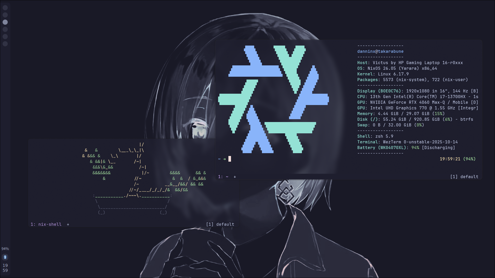
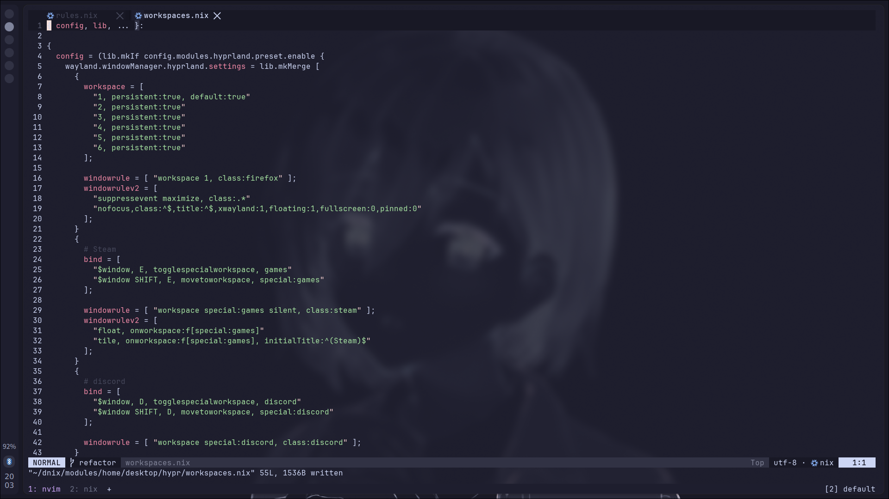

# flake.nix
[](https://builtwithnix.org)

| <p align="center"> [Wallpaper](https://github.com/NixOS/nixos-artwork/blob/master/wallpapers/nix-wallpaper-nineish-catppuccin-mocha-alt.png) |
| - |
|  
|  
|  

## Year 1 - Overview

### Stuff

[**Hyprland**](https://wiki.hypr.land)
- [hypridle](https://wiki.hypr.land/Hypr-Ecosystem/hypridle/) + [hyprlock](https://wiki.hypr.land/Hypr-Ecosystem/hyprlock/)
- [hyprshot](https://github.com/Gustash/hyprshot) + [swappy](https://github.com/jtheoof/swappy)
- [hyprpaper](https://wiki.hypr.land/Hypr-Ecosystem/hyprpaper/)
- Looking to replace the following with [quickshell](https://quickshell.org/) (separate repository being made):
    - [dunst](https://github.com/dunst-project/dunst) for notifications
    - [waybar](https://github.com/Alexays/Waybar) for status bar (quickshell bar shown in screenshots)
    - [fuzzel](https://codeberg.org/dnkl/fuzzel) for application launcher

[**Wezterm**](https://wezterm.org/)
- builtin mux
- [zsh](https://www.zsh.org/)
- [starship](https://starship.rs/) prompt
- [direnv](https://direnv.net/) for shell environments
- neovim via [nixvim](https://nix-community.github.io/nixvim/)

### Stuff that makes stuff
- [home-manager](https://nix-community.github.io/home-manager/index.xhtml#ch-introduction) for home configs and dotfile injection
- [stylix](https://nix-community.github.io/stylix/) for some automatic theming
- [nixvim](https://nix-community.github.io/nixvim/) for neovim configuration (probably going to move this to a standalone derivation)
- [impermanence](https://github.com/nix-community/impermanence) (only on laptop, just to try it out)

### Stuff in writing
```sh
repo
├── _readme         # files and assets for the `README.md`
├── assets          # mainly background images
├── modules         
    ├── home            # home manager modules
    └── nixos           # nixos modules 
├── hosts           # host configurations
├── utils           # helpful functions
├── flake.nix       # output definitions     
├── flake.lock      # version locking
└── README.md       # github preview
```

## Usage
(POV: you're me)
```sh
git clone https://github.com/danninx/flake.nix ~/dnix
cd ~/dnix
sudo nixos-rebuild switch --flake .#<hostname>
```
