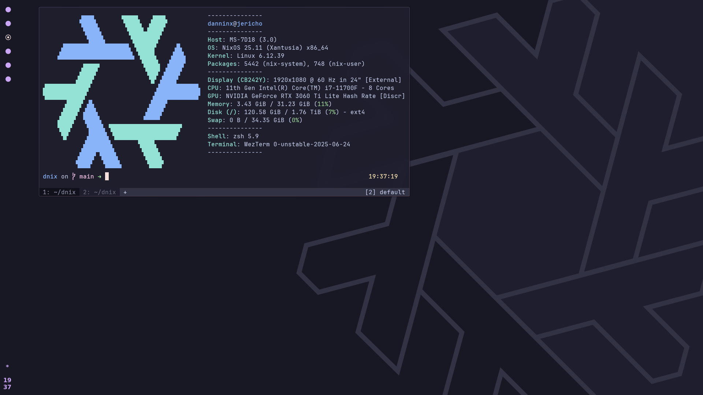
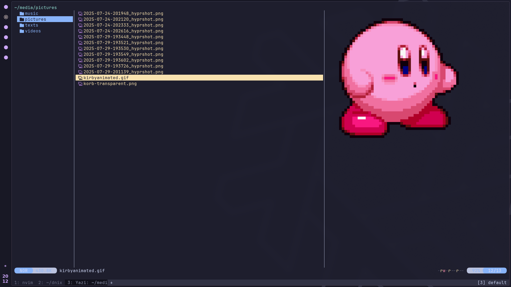

[](https://builtwithnix.org)
# flake.nix

NixOS system [flake](https://nixos.wiki/wiki/Flakes), 7-ish months in

We are now in the process of moving things to hyprland

| <p align="center"> [Wallpaper](https://github.com/NixOS/nixos-artwork/blob/master/wallpapers/nix-wallpaper-nineish-catppuccin-mocha-alt.png) |
| - |
|  
|  
|  

## Overview [WIP]

DE: **Hyprland**
- **dunst** for simple notifications
- **hypridle + hyprlock**
- **hyprshot + swappy** combo for taking and editing screenshots
- **waybar**
- currently using **fuzzel** for an application launcher, but looking into some other options

Terminal: **Wezterm**
- [**nixvim**]() for file editing
- **starship** for prompt
- **direnv** for automatic shell environments
    - I just added this one recently but could not recommend it enough


## Directory Structure

### Top level overview

```
repo
│ # TOP-LEVEL DIRECTORIES
├── _readme         # files and assets for the `README.md`
├── backgrounds     # desktop wallpaper images
├── dotfiles        # non-nix dotfiles (because sometimes it's just more convenient and portable)
├── home            # home manager modules
├── hosts           # host configurations
├── nixos           # nixos modules 
├── overrides       # overrides 
├── pkgs            # custom package definitions (for little projects I haven't put into flakes yet)
├── utils           # for moving templating functions out of the `flake.nix`
│ # TOP-LEVEL FILES
├── flake.nix       # output definitions     
├── flake.lock      # version locking
├── Makefile        # Makefile with useful shortcuts
└── README.md       # for github and sharing the project
```

### Host overview

```
host
├── modules/*       # host specific modules (such as nvidia configurations, hardware tweaks, etc.)
│
├── hardware.nix    # copy from hardware-configuration.nix
├── home.nix        # host specific home configurations
├── packages.nix    # default host packages (environment)
└── system.nix      # host specific configs
```

## Usage

### Setup
Clone the repo (I keep mine in my home directory for easy access)

```sh
git clone https://github.com/danninx/flake.nix
cd dnix
```

> [!NOTE]
> If the settings don't already exist in your repository, you'll need to enable them first before trying to use the flake:
```nix
...
nix.settings.experimental-features = [ "flakes" "nix-command" ];
nixpkgs.config.allowUnfree = true;
```

> [!CAUTION]
> Be sure to edit the `system.stateVersion` in the host files to match whatever is in your current configuration for maximum compatability. For safety, there are also template host configurations in the `hosts/` directory. You can start off by moving your `configuration.nix` and `hardware-configuration.nix` into that directory and importing them there

### `make` aliases

The old Makefile had a `make <HOST>` format, now it's just `make`, which will automatically grab your current hostname, and `make link` for the non-nixed dotfiles (one day...)

## Flakes

### Relevant Modules

| Module | Description |
| - | - |
| [home-manager](https://github.com/nix-community/home-manager) | Allows for declarative configuration of home and user environments
| [nixvim](https://github.com/nix-community/nixvim) | Declarative configuration of neovim and plugins. 
| [nixos-wsl](https://github.com/nix-community/NixOS-WSL) | NixOS on WSL(2) - I don't use this a ton but it means I can test dev shells on my desktop
| [plasma-manager](https://github.com/nix-community/plasma-manager) | Nix management of KDE Plasma (wraps around home-manager I believe, but much more convenient and intuitive) - I don't use this anymore on my desktop as Plasma imo has unfriendly dotfiles and configuration, hence the move towards hyprland
| [stylix](https://github.com/danth/stylix/) | Allows for easy theming, works with home manager to automatically apply fonts, colors, etc. across different applications; saves a TON of time

## Goats
- [martijnboers' config](https://github.com/martijnboers/nixos) - Awesome repo; I've had it starred for a while and it's a great reference
- [Misterio77 flake structure template](https://github.com/Misterio77/nix-starter-configs) - Amazing reference for beginners
- [Vimjoyer on YouTube](https://www.youtube.com/@vimjoyer) - Brought me here

