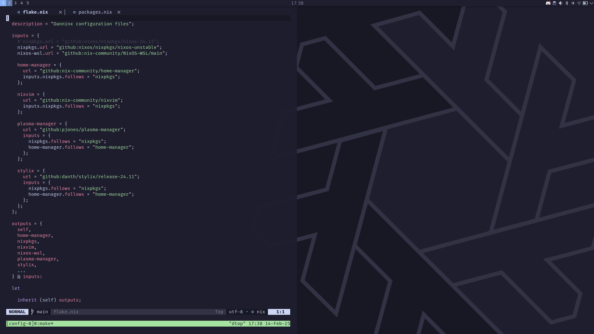

[](https://builtwithnix.org)
# flake.nix

NixOS system [flake](https://nixos.wiki/wiki/Flakes), 4-ish months in

|  
| - |
| <p align="center"> [Wallpaper](https://github.com/NixOS/nixos-artwork/blob/master/wallpapers/nix-wallpaper-nineish-catppuccin-mocha-alt.png) |

## Directory Structure
I'm aware that the structure of this repository is a bit different than what's common. It's just more intuitive for my own taste

### Top level overview

```
repo
│ # TOP-LEVEL DIRECTORIES
├── _readme         # files and assets for the README.md
├── backgrounds     # desktop wallpaper images
├── dotfiles        # non-nix dotfiles (because sometimes it's just more convenient and portable)
├── home            # home manager modules
├── hosts           # host configurations
├── Makefile        # Makefile with useful shortcuts
├── nixos           # nixos modules (essentially configuration presets for various items)
├── overrides       # overrides [WIP]
├── pkgs            # custom package definitions (for projects and packages not yet in nixpkgs)
├── utils
│ # TOP-LEVEL FILES
├── flake.nix       # output definitions     
├── flake.lock      # version locking
└── README.md       # for github and sharing the project
```

### Host overview

```
host
├── modules/*       # host specific modules (such as nvidia configurations, hardware tweaks, etc.)
│
├── hardware.nix    # copy from hardware-configuration.nix
├── home.nix        # host specific home configurations
├── packages.nix    # default host packages (environment)
└── system.nix      # host specific configs
```

## Usage

### Setup
Clone the repo (I keep mine in my home directory for easy access)

```sh
git clone https://github.com/danninx/flake.nix
cd dnix
```

> [!NOTE]
> If the settings don't already exist in your repository, you'll need to enable them first before trying to use the flake:
```nix
...
nix.settings.experimental-features = [ "flakes" "nix-command" ];
nixpkgs.config.allowUnfree = true;
```

> [!CAUTION]
> Be sure to edit the `system.stateVersion` in the host files to match whatever is in your current configuration for maximum compatability

### `make` aliases
I forget where I saw these first, and for the life of me I cannot find the repository, but nixos-rebuild has some pretty long commands, I just use a Makefile in order to shorthand some stuff.

The Makefile has commands for switching between different host configs:
```sh
make <HOST>

# this is the same as
sudo nixos-rebuild switch --flake ".#<HOST>"
```

and shorthands for updating
```sh
make

#or
make switch

# same as
sudo nixos-rebuild switch --flake .
```

It also has a `make edit` for editing in sudo, as I was having a weird bug where neovim didn't want to save certain files. If anyone else is having this, I managed to solve if by changing ownership of what was previous `hardware-configuration.nix` and `configuration.nix` from root to my user, and neovim gives much less of a fuss now.

## Docs

### Relevant Modules

| Module | Description |
| - | - |
| [home-manager](https://github.com/nix-community/home-manager) | Allows for declarative configuration of home and user environments
| [nixvim](https://github.com/nix-community/nixvim) | Declarative configuration of neovim and plugins. 
| [nixos-wsl](https://github.com/nix-community/NixOS-WSL) | NixOS on WSL(2) - I don't use this a ton but it means I can test dev shells on my desktop
| [plasma-manager](https://github.com/nix-community/plasma-manager) | Nix management of KDE Plasma (wraps around home-manager I believe, but much more convenient and intuitive )
| [stylix](https://github.com/danth/stylix/) | Allows for easy theming, works with home manager to automatically apply fonts, colors, etc. across different applications; saves a TON of time

### Notable References
- [martijnboers' config](https://github.com/martijnboers/nixos) - Awesome repo; I've had it starred for a while and it's a great reference
- [Misterio77 flake structure template](https://github.com/Misterio77/nix-starter-configs) - Amazing reference for beginners
- [Vimjoyer on YouTube](https://www.youtube.com/@vimjoyer) - Brought me here

